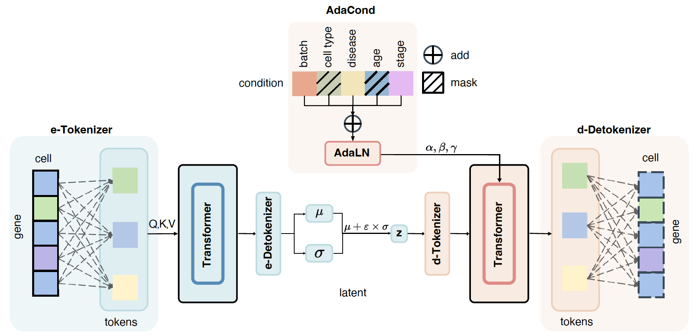

# SAVE: online integration and zero-shot generation of single-cell data via adaptive condition guidance



This repository contains code from the paper SAVE: online integration and zero-shot generation of single-cell data via adaptive condition guidance.


## Dependency

```
Python >= 3.9.16
CUDA == 12.3
```

Follow the code below to install the packages needed for python
```
pip install -r ./requirements.txt
```

The installation takes some time.

## Data

The data sources listed in the article are publicly available.

## Usage


Followings are our todo list about experiment tutorial.

- [x] [integration](/exps/integration.ipynb)
- [x] [online integration](exps/online_integration.ipynb)
- [x] [molecular space integraiton](exps/molecular_integration.ipynb)
- [x] [perturbation prediction](exps/perturbation_prediction.ipynb)
- [x] [multi-condtion perturbation prediction](exps/multi_cond_prediction)
- [x] [rare cell type generation](exps/rare_cell_generation.ipynb)
- [x] [zero-shot generation](exps/zero_shot_generation)


## Concat
- Jiahao Li: lijiahao23@m.fudan.edu.cn 